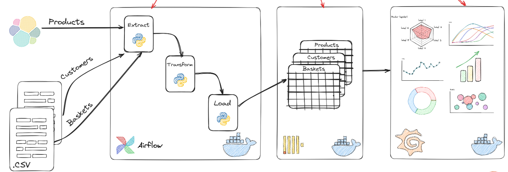

## Sales-DE-Pipeline
a sophisticated data engineering pipeline leveraging Apache Airflow for seamless workflow management and ClickHouse as the high-performance data warehouse to efficiently process and analyze e-commerce website sales data.
**

- **Data Collection:**
  - Acquired or generated e-commerce sales dataset with transaction date, product, quantity, price, and customer details.

- **Data Preprocessing:**
  - Cleansed and preprocessed data to handle missing values, outliers, and inconsistencies.

- **ClickHouse Data Warehouse Setup:**
  - Installed and configured ClickHouse for high-performance analytics.
  - Optimized table schema for efficient data storage and retrieval.

- **ETL Pipeline using Apache Airflow:**
  - Implemented Apache Airflow for end-to-end ETL pipeline management.
  - Designed DAGs for data extraction, transformation, and loading.
  - Scheduled regular DAG runs for automated processing.

- **Data Visualization:**
  - Utilized Grafana and Python libraries for creating insightful visualizations.
  - Showcased sales trends, customer behavior, and key metrics.

